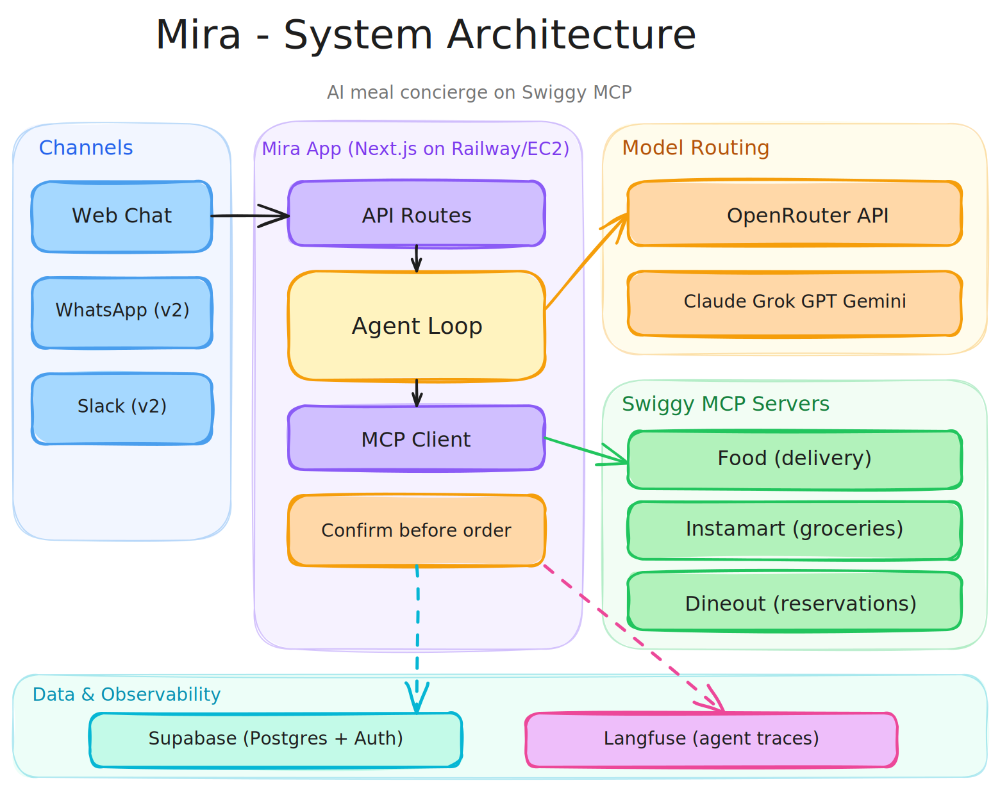
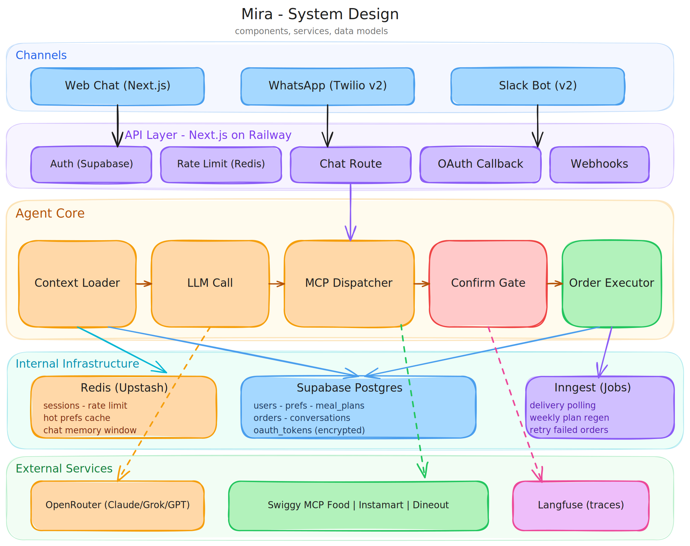

# Mira

An AI meal concierge that plans your week across Swiggy's full stack and actually executes it. Built on Swiggy's MCP platform (Food, Instamart, Dineout). Submitted to the Swiggy Builders Club.

## What it does

Mira is a chat agent. You tell it your budget and preferences, it plans your week and orders everything for you.

You say:
> "Plan me a week under ₹3000, high-protein, mostly veg, I'll cook on Sunday and Wednesday."

It splits the week across Swiggy:

* Instamart for the days you cook (groceries)
* Food for busy weekdays (delivery)
* Dineout for the weekend (reservation)

Same agent works on web in v1. WhatsApp and Slack come later as adapters on top of the same loop.

## Why it's a good fit for Swiggy

Right now Food, Instamart, and Dineout are three separate apps with three separate decisions. Mira treats food as one continuous problem ("what am I eating this week?"), and Swiggy is the only platform with all three surfaces. That's the wedge. Cross-product orchestration is uniquely possible here, and it's the kind of thing that drives more orders across the board.

## Example session

```
User:  Plan me a week under 3000, high-protein, lazy on Wednesdays.

Mira:  Here's your week:
       Mon  Cook (paneer bhurji, rotis)         Instamart  ₹420
       Tue  Cook (chickpea pulao)               Instamart  (covered)
       Wed  Order in (Behrouz biryani)          Food       ₹380
       Thu  Cook (egg curry, rice)              Instamart  (covered)
       Fri  Order in (Faasos wraps)             Food       ₹290
       Sat  Eat out (Truffles, Koramangala)     Dineout    ₹1100 est.
       Sun  Cook (paneer tikka pizza)           Instamart  ₹350

       Groceries Mon 9am. Saturday table for 2 at 8pm.
       Total ₹2540. Confirm?

User:  yes

Mira:  Done. Groceries on the way. Calendar invite sent for Saturday.
```

No money moves before the user says yes. Confirmation is always a separate step.

## Architecture

High level view of how everything connects. Channels on the left feed into a Next.js app, the agent loop talks to OpenRouter for the LLM and to Swiggy's MCP servers for actions, and Supabase plus Langfuse handle data and tracing.



## Conversation flow

What actually happens when a user chats with Mira. The agent loops between the LLM and the MCP servers to build a plan, then stops at a confirmation gate before placing any orders. No money moves without a yes.


## System design

The full picture with infrastructure and data models. Redis for sessions and caching, Postgres for plans and orders, Inngest for background jobs like delivery polling and weekly plan regeneration. The agent core is the yellow band in the middle.



## Tech stack

* **App**: Next.js (App Router). One codebase for UI and API routes.
* **Hosting**: Railway / EC2 / Render, whatever ends up cheapest. Just needs Node and Postgres.
* **DB and auth**: Supabase. Postgres, auth, and Swiggy OAuth token storage in one place.
* **Cache**: Redis (Upstash) for sessions, rate limits, and hot user prefs.
* **Models**: OpenRouter. One API key, swap between Claude, Grok, GPT, Gemini by changing a string.
* **MCP**: `@modelcontextprotocol/sdk` directly. No framework wrapper, direct control of the tool call loop.
* **Background jobs**: Inngest. Delivery polling, weekly plan regen, retry on failures.
* **Tracing**: Langfuse. Traces every agent turn. Non-negotiable when the agent is spending real money.
* **Channels (v2)**: Twilio for WhatsApp, Slack Bolt for Slack. Both feed into the same agent.

## Data models

In Postgres:

* `users` (id, email, created_at)
* `prefs` (user_id, budget, diet, cuisines, location)
* `oauth_tokens` (user_id, swiggy_access_token, refresh_token, encrypted)
* `meal_plans` (id, user_id, week_of, plan_json, status)
* `orders` (id, plan_id, mcp_server, swiggy_order_id, status)
* `conversations` (id, user_id, messages)

## MCP integration

Each Swiggy server is registered as a tool surface on the agent. When the user says something, the model picks which server to call based on intent: groceries for the week goes to Instamart, dinner tonight goes to Food, table for Saturday goes to Dineout. The model fills in args from chat context (prefs, budget, location, time), and every action that costs money goes through a confirm step. Order status comes back through the same MCP tools or via webhooks.

## Roadmap

**v1 (4 weeks from access grant)**
* Web chat
* Swiggy OAuth account linking
* Meal planning across Food, Instamart, Dineout
* Order placement with confirmation
* Order tracking via webhooks

**v2**
* WhatsApp adapter (Twilio)
* Slack adapter (Slack Bolt)
* Group ordering (dinner for 4 friends)

**v3**
* Calendar integration (busy day detection)
* Fitness app integration (macro targets)
* Pantry tracking and auto-restock

## Status

Applying to Swiggy Builders Club for MCP access. Happy to share a working prototype with the review team within 2 weeks of getting keys.

Contact: yrevash via the Builders Club application.
